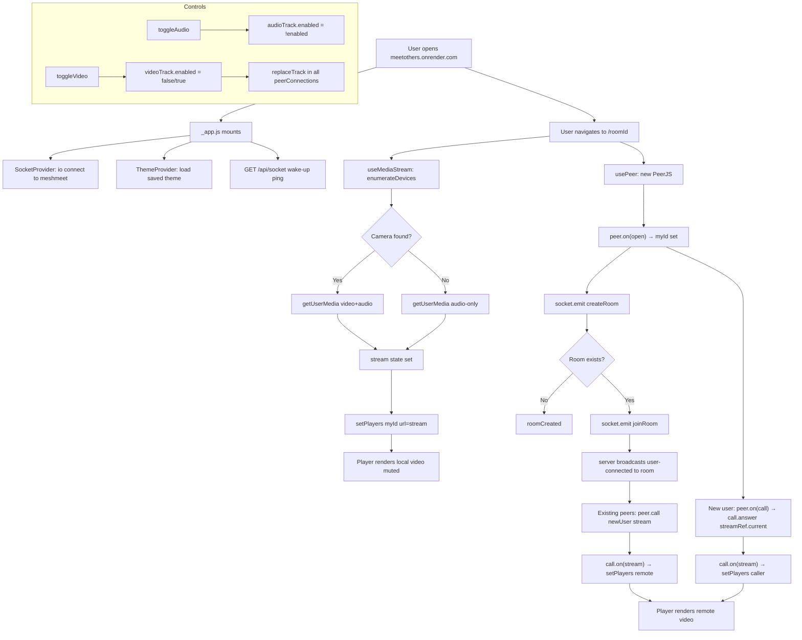

# MeshMeet — Architecture Document

> **App names:** The codebase is called `MeshMeet`. The brand/UI name is `MeetOthers`.  
> **Repo branch:** `beta1` on `NIKHIL-07-CYBER/MeetOthers`

---

## 1. System Topology

```
┌─────────────────────────────────────┐        ┌──────────────────────────────────────┐
│         meetothers.onrender.com      │        │         meshmeet.onrender.com         │
│         (Frontend Service)          │        │         (Backend Service)             │
│                                     │        │                                      │
│  Next.js 15 (Static + SSR)          │──HTTP──▶  GET /api/socket  (wake-up ping)    │
│  React 18                           │        │                                      │
│  PeerJS client                      │──WSS──▶  Socket.IO server  /api/socket/      │
│  Socket.IO client                   │        │  (attached to Next.js HTTP server)   │
│                                     │◀──────▶│                                      │
└─────────────────────────────────────┘        └──────────────────────────────────────┘
         │                 ▲
         │  WebRTC (DTLS)  │  P2P media — does NOT go through Render
         └─────────────────┘
         (direct browser-to-browser
          via STUN/TURN negotiation)
```

**Key insight:** There are **two completely separate Render web services** running the same Next.js codebase. `meshmeet` acts as the Socket.IO signaling server. `meetothers` is the user-facing frontend. They are same-codebase but serve different roles.

---

## 2. Technology Stack

| Layer | Technology | Version | Role |
|---|---|---|---|
| Framework | Next.js | ^15.4.6 | SSR + file-system routing + API routes |
| UI | React | ^18 | Component rendering |
| Signaling | Socket.IO | ^4.8.1 | Room events, toggles, chat |
| P2P Media | PeerJS | ^1.5.5 | WebRTC abstraction for video/audio |
| Animation | Framer Motion | ^12 | All UI transitions (LazyMotion for perf) |
| Particles | tsParticles + react-tsparticles | ^3/^2 | Background visual effect |
| Video Player | react-player | ^3.3.1 | (imported but video is rendered via raw `<video>` element in Player) |
| Icons | lucide-react | ^0.540.0 | All UI icons |
| Utility | lodash | ^4.17.21 | `cloneDeep` (no longer used in hot path — replaced by `useMemo`) |
| ID gen | uuid | ^11.1.0 | Room ID generation (`uuidv4`) |
| CSS | Tailwind CSS ^3.4 + CSS Modules | — | Utility classes + scoped styles |
| Deployment | Render.com | — | Two free-tier web services |

---

## 3. Two-Protocol Architecture

MeshMeet uses **two completely separate protocols** for two completely separate jobs:

```
┌─────────────────────────────────────────────────────────────────────┐
│                    PROTOCOL 1: Socket.IO (Signaling)                │
│                                                                     │
│  Purpose: coordinate WHO is in what room, and sync UI state        │
│  Transport: WebSocket (ws://) over HTTPS                           │
│  Path: /api/socket/ on meshmeet.onrender.com                       │
│  Persistence: maintained for full meeting duration                  │
│                                                                     │
│  Events emitted by clients:                                         │
│  ├── createRoom    { roomId, userId, userInfo }                    │
│  ├── joinRoom      { roomId, userId, userInfo }                    │
│  ├── leave-room    (roomId, userId)                                │
│  ├── user-toggled-audio  (userId, roomId, isAudioEnabled)         │
│  ├── user-toggled-video  (userId, roomId, isVideoEnabled)         │
│  ├── user-screen-share   (userId, roomId, isScreenSharing)        │
│  ├── user-hand-raise     (userId, roomId, isHandRaised)           │
│  ├── user-speaking       (userId, roomId, isSpeaking)             │
│  └── chatMessage   { roomId, message }                            │
│                                                                     │
│  Events emitted by server:                                          │
│  ├── roomCreated / roomExists / roomJoined / noSuchRoom           │
│  ├── newUserJoined  { userId, userInfo }                          │
│  ├── user-connected { userId }          ← triggers PeerJS call    │
│  ├── user-disconnected { userId }                                  │
│  ├── user-toggled-audio / video / screen-share / hand-raise       │
│  └── chatMessage   (message object)                               │
└─────────────────────────────────────────────────────────────────────┘

┌─────────────────────────────────────────────────────────────────────┐
│                    PROTOCOL 2: PeerJS / WebRTC (Media)              │
│                                                                     │
│  Purpose: transmit actual audio/video streams between peers        │
│  Transport: DTLS-SRTP directly between browsers (P2P)             │
│  ICE: Google STUN servers (stun.l.google.com:19302 + 19302)       │
│  Optional: TURN (via NEXT_PUBLIC_TURN_URL env var)                │
│                                                                     │
│  PeerJS cloud broker: peerjs.com (free tier)                      │
│  Used for: WebRTC offer/answer/ICE candidate exchange             │
│                                                                     │
│  Flow: caller.call(peerId, stream) → callee.answer(stream)        │
│        → both sides fire call.on("stream", remoteStream)          │
└─────────────────────────────────────────────────────────────────────┘
```

---

## 4. Complete Connection Lifecycle

### Phase 1 — App Bootstrap (`_app.js`)

```
Browser loads meetothers.onrender.com
│
├── ThemeProvider mounts
│   └── Reads localStorage + prefers-color-scheme
│       → Applies `dark` class to <html>
│
├── SocketProvider mounts (context/socket.js)
│   └── io("https://meshmeet.onrender.com", {
│         path: "/api/socket/",
│         transports: ["websocket"]
│       })
│
└── useEffect fires: GET /api/socket (wake-up ping)
    └── Ensure socket.io server is initialized on meshmeet
        (Next.js API route handler attaches Socket.IO to
         res.socket.server on first hit)
```

### Phase 2 — Room Entry (`pages/index.js`)

```
User lands on /
├── "Create New Room" → uuidv4() → Router.push(`/${uuid}`)
└── "Join Room"       → Router.push(`/${enteredId}`)
```

### Phase 3 — Room Page Init (`pages/[roomId].js`)

```
[roomId].js mounts
│
├── useMediaStream() — starts immediately
│   └── enumerateDevices() → detect hasCamera, hasMic
│       → getUserMedia({ video: hasCamera, audio: hasMic })
│       → stream state set, streamRef.current = stream
│
├── usePeer() — starts when roomId is available
│   └── new PeerJS(undefined, { iceServers, pingInterval: 3000 })
│       → peer.on("open", id) → setMyId(id)
│                                           ↓
│                              myId is now truthy → triggers socket join
│
└── usePlayer(myId, roomId)
    └── players state, playerHighlighted (= myId), nonHighlighted (= others)
```

### Phase 4 — Socket Room Join (triggered by `myId`)

```
myId becomes available
│
└── socket.emit("createRoom", { roomId, userId: myId, userInfo })
    │
    ├── Server: room doesn't exist yet
    │   → socket.join(roomId)
    │   → socket.emit("roomCreated")        [Host path]
    │
    └── Server: room exists
        → socket.emit("roomExists")
        → client emits "joinRoom"
        → server: socket.join(roomId)
                  socket.emit("roomJoined")
                  socket.broadcast.to(roomId).emit("newUserJoined", { userId, userInfo })
                  socket.broadcast.to(roomId).emit("user-connected", { userId })
                                                          ↓
                                    EXISTING peers receive "user-connected"
                                    → peer.call(newUserId, stream)   [Caller side]
```

### Phase 5 — PeerJS Call Establishment

```
Existing peer (Alice) receives "user-connected" { userId: Bob }
│
└── call = peer.call(Bob, aliceStream)
    └── call.on("stream", remoteStream)
        → setPlayers({ ...players, [bob]: { url: remoteStream, playing, muted } })

Bob (incoming call) — handled by peer.on("call") registered once on peer open
│
└── call.answer(streamRef.current)     ← always latest stream via ref
    └── call.on("stream", incomingStream)
        → setPlayers({ ...players, [alice]: { url: incomingStream } })

Both sides now render each other's Player components with live MediaStreams.
```

---

## 5. File & Module Map

```
d:\fix\projects\meet\
│
├── pages/
│   ├── _app.js              App shell — ThemeProvider + SocketProvider + wake-up ping
│   ├── _document.js         Custom HTML document (font preloads etc.)
│   ├── index.js             Landing page — create/join room UI
│   ├── [roomId].js          Room page — all meeting logic orchestrated here
│   └── api/
│       ├── socket.js        Socket.IO server — attaches to Next.js HTTP server
│       └── hello.js         Unused default API route
│
├── context/
│   ├── socket.js            SocketProvider — io() connection, reconnect logic
│   └── theme.js             ThemeProvider — dark/light with localStorage persist
│
├── hooks/
│   ├── useMediaStream.js    getUserMedia, enumerateDevices, toggle audio/video/screen
│   ├── usePeer.js           PeerJS instance creation and lifecycle
│   └── usePlayer.js         players state + useMemo split (highlighted vs others)
│
├── components/
│   ├── Player/index.js      <video> element + overlay — audio/video/hand/speaking
│   ├── Controls/index.js    Meeting toolbar — all 9 control buttons + keyboard shortcuts
│   ├── Navbar/index.js      Top bar — branding, meeting info, copy link, theme toggle
│   ├── ChatSidebar/index.js Slide-in chat panel (local state, not yet socket-wired)
│   ├── ParticipantList/     Slide-in participants panel
│   ├── Bottom/              (utility)
│   ├── MeetingControls.js   (alternative/unused controls variant)
│   └── ParticleBackground/  tsParticles animated background
│
├── styles/
│   ├── globals.css
│   ├── home.module.css
│   └── room.module.css
│
├── next.config.js           Cache-Control header for /api/socket
├── render.yaml              Two-service Render deployment spec
└── package.json
```

---

## 6. React State Architecture

### `players` — The Central State Object

All video participants are stored in a single `players` object in `usePlayer`. Shape:

```js
{
  [peerId]: {
    url:          MediaStream | null,  // The live WebRTC stream
    muted:        boolean,             // true = audio muted (our own = always true)
    playing:      boolean,             // true = video ON
    isHandRaised: boolean,
    isSpeaking:   boolean,
    name:         string,              // "User abc123"
  }
}
```

### `playerHighlighted` vs `nonHighlighted`

`usePlayer` splits `players` into two views using `useMemo` (no cloneDeep, no MediaStream serialisation):

```
players = { [myId]: {...}, [peer1]: {...}, [peer2]: {...} }
               ↓
playerHighlighted = players[myId] + { userId: myId }   ← big center tile
nonHighlighted    = { [peer1]: {...}, [peer2]: {...} }  ← small sidebar tiles
```

### State update sources

| Source | What it mutates |
|---|---|
| `useMediaStream` stream ready | `players[myId].url = stream` |
| PeerJS `call.on("stream")` | `players[peerId].url = remoteStream` |
| Socket `user-connected` | `peer.call()` → triggers above |
| Socket `newUserJoined` | Adds placeholder `{ url: null, playing: false }` for new peer |
| Socket `user-disconnected` | Deletes `players[peerId]` |
| Socket `user-toggled-audio` | `players[peerId].muted = !isAudioEnabled` |
| Socket `user-toggled-video` | `players[peerId].playing = isVideoEnabled` |
| Socket `user-hand-raise` | `players[peerId].isHandRaised = isHandRaised` |

---

## 7. Hook Architecture Detail

### `useMediaStream` — Media Device Layer

```
initStream(constraints = null)
│
├── Check navigator.mediaDevices exists (HTTPS guard)
├── enumerateDevices() → { hasCamera, hasMic }
│   └── If neither: setError + return null (graceful, no crash)
├── Build constraints: { video: hasCamera, audio: hasMic }
├── getUserMedia(constraints)
│   └── On NotFoundError + both requested:
│       └── retry initStream({ video: false, audio: true })
└── Returns MediaStream

State exposed:
  stream, isVideoEnabled, isAudioEnabled, isScreenSharing, error

Toggle design (critical — does NOT drop PeerJS connection):
  toggleAudio()  → audioTrack.enabled = !audioTrack.enabled
  toggleVideo()  → videoTrack.enabled = false  (disable, not stop)
                 → if re-enabling: videoTrack.enabled = true (existing track)
                 → if track was stopped: new getUserMedia → combinedStream
```

### `usePeer` — PeerJS Lifecycle

```
Dependencies: roomId
Guard: isPeerSet.current (prevent double-init in React StrictMode / Fast Refresh)

Init:
  new PeerJS(undefined, {
    config: { iceServers: [google STUN x2, optional TURN] },
    pingInterval: 3000,
    debug: 2 (dev) | 0 (prod)
  })

Events:
  peer.on("open", id) → setMyId(id)       ← drives socket join
  peer.on("error", err) → console.error

Cleanup: peer.destroy() on unmount
```

### `usePlayer` — View Model

```
Input: myId, roomId
Output: players, setPlayers, playerHighlighted, nonHighlighted

useMemo(() => {
  const nonHighlighted = { ...players };
  const playerData = nonHighlighted[myId];
  delete nonHighlighted[myId];
  return {
    playerHighlighted: playerData ? { ...playerData, userId: myId } : null,
    nonHighlighted
  };
}, [players, myId]);
```

---

## 8. Media Stream Pipeline

```
getUserMedia()              Socket.IO          PeerJS (WebRTC)
    │                         │                     │
    ▼                         │                     │
MediaStream ──────────────────┼─────────────────────▶ peer.call(remoteId, stream)
    │                         │                     │
    │                         │                  RTCPeerConnection
    │                         │                  STUN negotiation
    │                         │                  ICE candidate exchange
    │                         │                  DTLS-SRTP handshake
    │                         │                     │
    │                    user-connected         call.on("stream", remoteStream)
    │                    (triggers call)             │
    ▼                                               ▼
Player <video> element                    Player <video> element
srcObject = localStream                  srcObject = remoteStream
muted = true (own audio)                 muted = false

Toggle audio/video:
  track.enabled = false ──▶ sends silent/black frame to all RTCRtpSenders
                            (PeerJS connection stays alive — no renegotiation)

Screen share:
  getDisplayMedia() → new MediaStream
  → sender.replaceTrack(screenVideoTrack)  ← replaces in all peerConnections
  → restore: initStream() → sender.replaceTrack(cameraTrack)
```

---

## 9. Socket.IO Server Architecture (`pages/api/socket.js`)

```
Next.js API Route — GET/POST /api/socket
│
└── socketHandler(req, res)
    │
    ├── if (!res.socket.server.io)   ← singleton guard — only init once
    │   new Server(res.socket.server, {
    │     cors: { origin: [localhost, meetothers, meshmeet], credentials: true },
    │     transports: ["websocket", "polling"],
    │     path: "/api/socket/",
    │     pingTimeout: 20000,
    │     pingInterval: 15000
    │   })
    │   res.socket.server.io = io    ← store on HTTP server for reuse
    │
    └── res.end()    ← Wake ping response (no body needed)

Room model: Socket.IO built-in adapter rooms (in-memory)
  No Redis, no persistence — rooms exist only while at least one socket is connected.

Socket events lifecycle:
  connection → join-room | createRoom | joinRoom
             → user-toggled-* (broadcast to room)
             → chatMessage (io.to(roomId) — includes sender)
             → user-hand-raise (io.to — includes sender for self-highlight)
             → leave-room
             → disconnect (auto-cleanup via socket.roomId/userId stored on socket obj)
```

---

## 10. Render Deployment Architecture

```yaml
# render.yaml
services:
  - type: web
    name: meshmeet               # Backend / signaling service
    env: node
    region: oregon
    plan: free
    buildCommand: npm install && npm run build
    startCommand: npx next start -H 0.0.0.0 -p $PORT
```

> Both `meshmeet` and `meetothers` use the **same render.yaml** from the same repo.  
> `meetothers` is a separate Render service pointing to the same GitHub repo / branch.

**Why two services from one codebase?**  
Next.js "serverless-style" API routes can still host a persistent Socket.IO server — but only one instance can act as the signaling hub. Splitting into two services ensures the frontend (meetothers) can go to sleep independently while the backend (meshmeet) stays warm during a live meeting.

**Port binding:** `npx next start -H 0.0.0.0 -p $PORT`  
- `-H 0.0.0.0` → binds to all interfaces (required on Render)  
- `-p $PORT` → Render injects the actual port dynamically; hardcoding 3000 breaks health checks

---

## 11. Component Hierarchy

```
_app.js
└── ThemeProvider
    └── SocketProvider (io() connection lives here)
        └── <Component> (current page)

index.js (Landing Page)
└── LazyMotion
    ├── ParticleBackground
    └── Home
        ├── Brand header
        ├── Room ID input + Join button
        └── Create New Room button → uuidv4() → Router.push

[roomId].js (Meeting Room) — the orchestration layer
├── Navbar
│   ├── Brand logo
│   ├── Meeting duration timer
│   ├── Participant count
│   └── Copy link button
│
├── ParticleBackground
│
├── Video Grid
│   ├── playerHighlighted → Player (large, active tile)
│   └── nonHighlighted[]  → Player (small, sidebar tiles)
│
├── Controls (fixed bottom toolbar)
│   ├── Mic toggle       [M key]
│   ├── Camera toggle    [V key]
│   ├── Screen share     [Ctrl+S]
│   ├── Hand raise       [H key]
│   ├── Chat toggle      [C key]
│   ├── Participants toggle
│   ├── Recording toggle
│   ├── Settings
│   └── End call
│
├── ChatSidebar (fixed right, slide-in)
└── ParticipantList (fixed right, slide-in)

Player component (each video tile)
├── <video> element (always in DOM when stream exists)
│   └── srcObject = stream (set in useEffect on stream change)
│       play() called with autoplay fallback
├── Avatar placeholder (AnimatePresence — shown when playing=false)
├── Status overlay
│   ├── Mic icon (muted/unmuted)
│   └── Connection quality dot
├── Hand raise indicator (AnimatePresence)
├── Speaking border ring (AnimatePresence)
└── Loading spinner (while video decoding)
```

---

## 12. Data Flow Diagram



---

## 13. Known Limitations & Technical Debt

| Area | Issue | Status |
|---|---|---|
| **Chat** | `ChatSidebar` uses local-only state. Socket `chatMessage` events ARE wired in `[roomId].js` but `ChatSidebar` receives `messages` prop not connected to socket yet | Partial |
| **Scalability** | Socket.IO adapter is in-memory — restarting meshmeet clears all rooms. No Redis adapter. | Accepted (free tier) |
| **TURN server** | Only STUN is configured by default. Peers behind symmetric NAT cannot connect. | Manual (env var) |
| **PeerJS cloud** | Uses peerjs.com free broker for WebRTC signaling. Can rate-limit on high traffic. | Accepted |
| **Render free tier** | Service sleeps after 15min inactivity — first load has ~30s cold start | Accepted |
| **`join-room` legacy** | Socket.IO server still handles a legacy `join-room` event for backward compat. Unused by current client. | Safe to remove |
| **Recording button** | `isRecording` state toggled locally — no actual MediaRecorder implementation | UI only |
| **ParticipantList** | Receives `participants` array derived from `players` — speaking/quality hardcoded | Placeholder |
| **Screen share audio** | `getDisplayMedia({ audio: true })` — browser support varies. Falls back silently. | Known |
